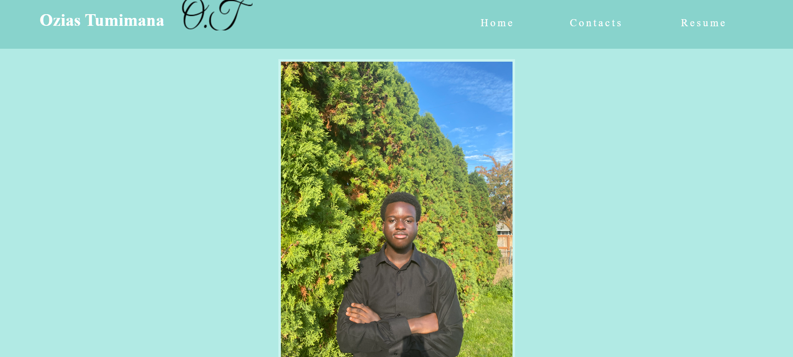

# Personal Portfolio Website

A responsive and clean personal portfolio website built from scratch with HTML and CSS. This site serves as a central hub to showcase my projects, background, and professional resume for internship opportunities.

**Live Demo: [Visit Site](https://ozias-tumimana.github.io/)**

 <!-- Take a screenshot and add it to your img/ folder -->

## 🚀 Features

- **Multi-Page Layout:** Dedicated pages for Home (About Me), Resume, and Contact information.
- **Fully Responsive Design:** Layout and images scale appropriately across different screen sizes.
- **Custom Styling:** Clean, original CSS with a consistent color scheme and typography using Google Fonts (Nunito).
- **Semantic HTML:** Proper use of semantic tags (`<header>`, `<nav>`, `<main>`, `<section>`, `<footer>`) for better structure and accessibility.

## 🛠️ Technologies Used

*   **HTML5** - For the website's structure and content.
*   **CSS3** - For custom styling, layout, and responsiveness.

## 📁 Project Structure

## 🌟 Key Pages

*   **Home (`index.html`)**: Introduces who I am, my background, and my interests. Features a clean, professional design with a navigation bar.
*   **Resume (`resume.html`)**: Hosts a current copy of my resume for easy viewing and downloading.
*   **Contacts (`contacts.html`)**: Provides direct links to my professional email and social media for easy contact.

## 🔮 Future Enhancements

This is a living project. Planned future updates include:
- Integrating JavaScript for more interactive elements.
- Adding a dedicated "Projects" section to dynamically showcase my work.
- Implementing a more advanced CSS framework for enhanced responsiveness.
- Converting the resume page to a styled HTML version instead of an image.

## 📞 Connect With Me

*   **LinkedIn:** [Connect With Me On Linkedin!](https://www.linkedin.com/in/ozias-tumimana-4a1bb42a4/)
*   **Email:** [Send me an Email!](mailto:oziast@uw.edu)
*   **GitHub:** [Check Out My GitHub!](https://github.com/Ozias-Tumimana)

---

© 2025 Ozias Tumimana. This portfolio is a continual work in progress.
